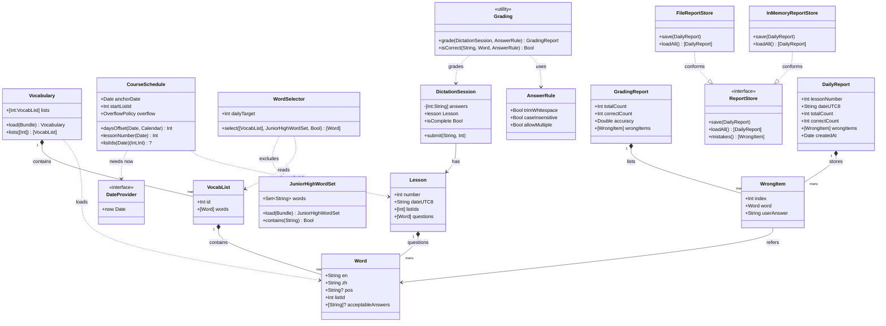
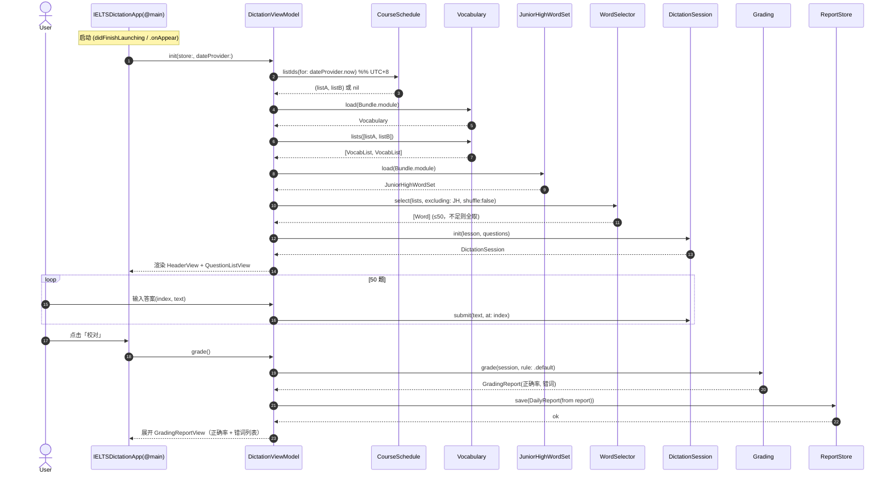
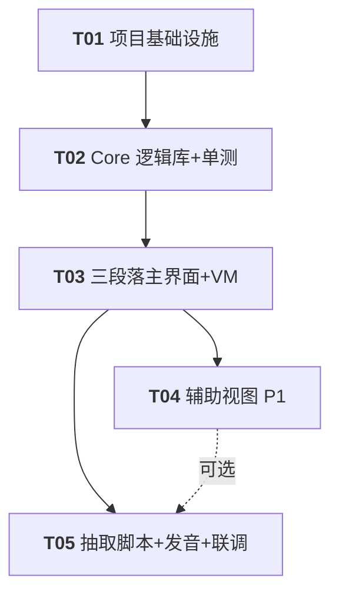

# 架构设计文档 · IELTS 绿宝书默写练习应用（macOS）

> 作者：架构师 高见远（Gao）
> 团队：software-ielts-dictation
> 配套 PRD：`docs/PRD.md`
> 范围：仅架构设计与任务分解，不含实现代码。

---

## 1. 实现方案与框架选型

### 1.1 技术挑战与选型理由

| 难点 | 选型 / 处理 |
|------|------------|
| PDF 为纯图像扫描件，运行时无法解析 | **架构不耦合 PDF**：应用运行时只加载一份预先生成、随包打包的结构化词库 `vocab.json`（由 `tools/extract_vocab.py` 抽取/OCR 阶段产出）。Core 层永远只消费 JSON，不碰 PDF。 |
| 核心逻辑要可单测（`swift test`） | 采用 **SwiftPM 多 target**：`IELTSDictationCore`（纯 Swift + Foundation，无 SwiftUI/AppKit 依赖）承载模型、课程调度、单词筛选、默写会话、批改、持久化协议；`IELTSDictationApp` 为 macOS 13+ SwiftUI 应用 target，仅消费 Core。 |
| `swift test` 可行性 | Core 仅依赖 Foundation，可在任意平台（含 CI/Linux）用 `swift test` 跑全部单测；App target 因依赖 SwiftUI 不参与 `swift test`，故所有可测逻辑下沉至 Core。通过 `DateProvider` 协议注入"当前日期"，使调度单测确定性。 |
| 本地零联网持久化 | 历史报告 / 错词本 / 进度写入 `~/Library/Application Support/<bundle-id>/` 下的单个 JSON 文件（`FileReportStore`）；轻量配置（锚定日、每日词量等）用 `UserDefaults`。Core 定义 `ReportStore` 协议并给出文件实现，测试用内存实现。 |
| 发音（P2） | 使用系统 **AVFoundation** `AVSpeechSynthesizer`，**零第三方依赖**。 |

### 1.2 架构分层

```
┌─────────────────────────────────────────────┐
│  IELTSDictationApp (macOS 13+, SwiftUI)      │  ← 依赖 Core，不反向
│  Views / ViewModels / Audio                 │
└───────────────────┬─────────────────────────┘
                    │ depends on
┌───────────────────▼─────────────────────────┐
│  IELTSDictationCore (pure Swift+Foundation)  │  ← 可 swift test
│  Models / Scheduling / Selection /          │
│  Session / Persistence(protocol+file)        │
└─────────────────────────────────────────────┘
                    │ loads
        ┌───────────┴────────────┐
        │ bundled JSON resources  │
        │ vocab.json / junior_high.json │
        └────────────────────────┘
```

**依赖方向铁律**：`App → Core`；`Core → Foundation only`；Core 永不 `import SwiftUI / AppKit / App`。

---

## 2. 文件列表及相对路径（目录树）

```
ielts-dictation/
├── Package.swift                                  # SwiftPM：Core 库 + CoreTests
├── Sources/
│   ├── IELTSDictationCore/                        # 可单测纯逻辑（Foundation only）
│   │   ├── Models/
│   │   │   ├── Word.swift                         # 单词模型
│   │   │   ├── VocabList.swift                    # 单个 list
│   │   │   ├── Vocabulary.swift                   # 全量词库容器 + 加载
│   │   │   └── JuniorHighWordSet.swift            # 初中词表（去重集合）
│   │   ├── Scheduling/
│   │   │   ├── CourseSchedule.swift               # 日期→当日 2 个 list（UTC+8）
│   │   │   └── DateProvider.swift                 # 可注入"今天"的协议
│   │   ├── Selection/
│   │   │   └── WordSelector.swift                 # 排除初中词 + 抽 50
│   │   ├── Session/
│   │   │   ├── DictationSession.swift             # 题目 + 用户答案态
│   │   │   ├── Grading.swift                      # 比对 → GradingReport
│   │   │   ├── GradingReport.swift                # 报告 / WrongItem / AnswerRule
│   │   │   └── Lesson.swift                       # 当日课聚合（序号/日期/list/题）
│   │   ├── Persistence/
│   │   │   ├── ReportStore.swift                  # 协议
│   │   │   ├── FileReportStore.swift              # App Support JSON 实现
│   │   │   ├── InMemoryReportStore.swift          # 测试用实现
│   │   │   └── DailyReport.swift                  # 单日报告 / 错词持久结构
│   │   ├── Bundle+Resources.swift                # Bundle.module 资源读取助手
│   │   └── Resources/
│   │       ├── vocab.json                         # 随包词库（抽取阶段填，先占位）
│   │       └── junior_high.json                   # 初中词表（内置 ~1600，可替换）
│   └── IELTSDictationApp/                         # macOS App target
│       ├── IELTSDictationApp.swift                # @main App 入口
│       ├── Info.plist
│       ├── ViewModels/
│       │   └── DictationViewModel.swift           # 绑定 Core 会话 + 存储
│       ├── Views/
│       │   ├── ContentView.swift                  # 三段式总布局
│       │   ├── HeaderView.swift                   # 顶部：课次/日期/词数/状态
│       │   ├── QuestionListView.swift             # 中部：可滚动 50 题
│       │   ├── DictationQuestionView.swift        # 单题：词性+中文 + 下划线输入
│       │   ├── GradingReportView.swift            # 底部：正确率+错词展开
│       │   ├── HistoryView.swift                  # P1 历史报告
│       │   ├── MistakeBookView.swift              # P1 错词本/复习
│       │   └── ProgressView.swift                 # P1 进度可视化
│       └── Audio/
│           └── WordSpeaker.swift                  # P2 AVFoundation 发音
├── Tests/
│   └── IELTSDictationCoreTests/
│       ├── CourseScheduleTests.swift
│       ├── WordSelectorTests.swift
│       ├── GradingTests.swift
│       ├── DictationSessionTests.swift
│       └── FileReportStoreTests.swift
├── tools/
│   └── extract_vocab.py                           # OCR/文本 → vocab.json（工程师实现）
└── docs/
    ├── PRD.md
    ├── ARCHITECTURE.md
    ├── class-diagram.mermaid
    └── sequence-diagram.mermaid
```

---

## 3. 数据模型与接口

### 3.1 核心类型（Swift 接口签名，非实现）

```swift
// —— Models ——
struct Word: Codable, Equatable, Identifiable {
    let en: String                 // 英文（规范拼写）
    let zh: String                 // 中文释义
    let pos: String?               // 词性，如 "v." / "n."，可空
    let listId: Int                // 所属 list 编号
    var acceptableAnswers: [String]? // 可选：其他可接受拼写（英美变体等）
}

struct VocabList: Codable {
    let id: Int
    let words: [Word]
}

struct Vocabulary {
    let lists: [Int: VocabList]
    static func load(from bundle: Bundle) throws -> Vocabulary
    func lists(with ids: [Int]) -> [VocabList]
}

struct JuniorHighWordSet {
    let words: Set<String>         // 小写英文集合，O(1) 查重
    static func load(from bundle: Bundle) throws -> JuniorHighWordSet
    func contains(_ en: String) -> Bool
}

// —— Scheduling ——
protocol DateProvider { var now: Date { get } }

struct CourseSchedule {
    let anchorDate: Date           // 锚定日（d=0）
    let startListId: Int           // 默认 17
    let overflow: OverflowPolicy   // .stop（默认）| .loop
    func daysOffset(for date: Date, calendar: Calendar) -> Int
    func lessonNumber(for date: Date) -> Int
    func listIds(for date: Date) -> (Int, Int)?   // nil 表示已学完/无课
}

enum OverflowPolicy { case stop, loop }

// —— Selection ——
struct WordSelector {
    let dailyTarget: Int           // 默认 50
    func select(from lists: [VocabList],
                excluding set: JuniorHighWordSet,
                shuffle: Bool = false) -> [Word]  // 不足则取全部
}

// —— Session ——
struct Lesson {
    let number: Int
    let dateUTC8: String           // "2026-07-14"
    let listIds: [Int]
    let questions: [Word]
}

final class DictationSession {
    let lesson: Lesson
    private(set) var answers: [Int: String]   // index -> 用户答案
    func submit(_ answer: String, at index: Int)
    var isComplete: Bool
}

struct AnswerRule {
    var trimWhitespace: Bool = true
    var caseInsensitive: Bool = true
    var allowMultiple: Bool = true     // 允许多 acceptableAnswers
}

struct WrongItem {
    let index: Int
    let word: Word
    let userAnswer: String
}

struct GradingReport {
    let totalCount: Int
    let correctCount: Int
    let accuracy: Double               // 0..1
    let wrongItems: [WrongItem]
}

enum Grading {
    static func grade(session: DictationSession,
                      rule: AnswerRule = .default) -> GradingReport
    static func isCorrect(user: String, word: Word, rule: AnswerRule) -> Bool
}

// —— Persistence ——
protocol ReportStore {
    func save(_ report: DailyReport) throws
    func loadAll() throws -> [DailyReport]
    func mistakes() -> [WrongItem]
}

struct DailyReport: Codable {
    let lessonNumber: Int
    let dateUTC8: String
    let totalCount: Int
    let correctCount: Int
    let wrongItems: [WrongItem]
    let createdAt: Date
}
```

### 3.2 类图（Mermaid）



### 3.3 JSON Schema

**`vocab.json`（随包词库，由 `tools/extract_vocab.py` 产出）**

```json
{
  "version": 1,
  "source": "雅思词汇绿宝书(1).pdf",
  "lists": [
    {
      "id": 17,
      "words": [
        { "en": "abandon", "zh": "放弃；抛弃", "pos": "v." },
        { "en": "abnormal", "zh": "反常的，异常的", "pos": "adj.",
          "acceptableAnswers": ["abnormal"] }
      ]
    },
    { "id": 18, "words": [ { "en": "abolish", "zh": "废止，废除", "pos": "v." } ] }
  ]
}
```

**`junior_high.json`（内置初中课标词表，可替换）**

```json
{
  "version": 1,
  "description": "初中英语课标词表（可整体替换）",
  "words": ["apple", "book", "cat", "dog", "ability", "about", "above", "..."]
}
```

> 说明：初中词表用**纯英文小写字符串数组**即可（只需做排除判定），体积更小、解析更简单。

---

## 4. 程序调用流程（时序图，Mermaid）



**关键对象初始化顺序**：`Vocabulary.load` 与 `JuniorHighWordSet.load` 在首次进入主界面时完成（一次性缓存到 VM）；`CourseSchedule` 以常量 `anchorDate` + `startListId=17` 构造，单例共享。

---

## 5. 任务列表（有序、含依赖、按实现顺序）

> 遵循硬约束：**≤5 个任务**、**每任务 ≥3 文件**、**首任务为项目基础设施**。任务间依赖尽量扁平（仅 T02 形成主干，T03/T04/T05 主要依赖 T02 或上一 UI 层）。

| 任务 ID | 任务名 | 涉及文件（≥3） | 前置依赖 | 优先级 | 验收点 |
|---------|--------|----------------|----------|--------|--------|
| **T01** | 项目基础设施与资源占位 | `Package.swift`、`Sources/IELTSDictationApp/IELTSDictationApp.swift`、`Info.plist`、`Sources/IELTSDictationApp/Views/ContentView.swift`(占位)、`Sources/IELTSDictationCore/Bundle+Resources.swift`、`Sources/IELTSDictationCore/Resources/vocab.json`(占位)、`junior_high.json`(占位) | 无 | P0 | `swift build` 通过；App 可启动显示空壳窗口；Core 资源可被 `Bundle.module` 读取 |
| **T02** | Core 逻辑库：模型 / 课程调度 / 筛选 / 会话 / 批改 / 持久化 + 单测 | `Models/{Word,VocabList,Vocabulary,JuniorHighWordSet}.swift`、`Scheduling/{CourseSchedule,DateProvider}.swift`、`Selection/WordSelector.swift`、`Session/{DictationSession,Grading,GradingReport,Lesson}.swift`、`Persistence/{ReportStore,FileReportStore,InMemoryReportStore,DailyReport}.swift`、`Tests/IELTSDictationCoreTests/{CourseScheduleTests,WordSelectorTests,GradingTests,DictationSessionTests,FileReportStoreTests}.swift` | T01 | P0 | `swift test` 全绿；课程调度确定性（锚定日→list17/18）、筛选排除初中词且≤50、批改正确率与错词准确、报告可落盘/内存往返 |
| **T03** | SwiftUI 三段落主界面 + 视图模型 | `ViewModels/DictationViewModel.swift`、`Views/{ContentView,HeaderView,QuestionListView,DictationQuestionView,GradingReportView}.swift` | T02 | P0 | 顶部课次/日期/词数/状态正确；中部 50 题可滚动、回车顺畅切题；底部「校对」展开正确率与错词（中文释义/你填/正确） |
| **T04** | 辅助视图与样式（P1） | `Views/{HistoryView,MistakeBookView,ProgressView}.swift`、全局样式（可并入 `ContentView` 或新增 `Views/Styles.swift`） | T03 | P1 | 历史报告列表可查；错词本可复习；进度可视化展示 |
| **T05** | 抽取脚本 + 发音(P2) + 集成调试 | `tools/extract_vocab.py`、`Audio/WordSpeaker.swift`、`Views/...`(发音按钮接入)、集成联调 | T03（及 T04 若启用发音入口） | P1/P2 | `extract_vocab.py` 能从文本/OCR 产出合规 `vocab.json`；点击单词可朗读（AVFoundation）；整体联调无崩溃、数据闭环 |

**任务依赖图（Mermaid）**



---

## 6. 依赖包列表

**第三方依赖：无（零依赖）。**
- 核心逻辑仅用 Swift 标准库 + Foundation（SwiftPM 自带）。
- 发音（P2）使用系统框架 **AVFoundation**（`AVSpeechSynthesizer`），无需引入任何包。
- UI 使用 SwiftUI（Apple 官方，随 SDK）。
- 若后续需要更高级 TTS 或 OCR，再单独评估；当前阶段坚决保持零依赖以降低打包与维护成本。

`Package.swift` 仅声明 `IELTSDictationCore` 库 target 及其 `Resources`，不引入 `dependencies`。

---

## 7. 共享知识（跨文件约定）

- **时区处理（统一）**：所有日期运算使用
  `Calendar(identifier: .gregorian)` 配合 `TimeZone(identifier: "Asia/Shanghai")`，**禁止**直接使用设备本地时区或 `Date()` 裸用。UI 展示的日期字符串格式固定 `yyyy-MM-dd`（UTC+8）。
- **"今天"可注入**：Core 内一律通过 `DateProvider` 协议取 `now`，便于单测固定锚定日；App 层提供系统实现。
- **答案比对默认规则（AnswerRule.default）**：
  1. `trimWhitespace = true`：忽略首尾空格；
  2. `caseInsensitive = true`：大小写不敏感；
  3. `allowMultiple = true`：若 `Word.acceptableAnswers` 非空，任一匹配即判对（覆盖英美变体/近似拼写）；
  4. 多词答案以单空格归一化中间空白。
- **模块依赖方向**：`App → Core`；`Core → Foundation only`。Core 中**不得**出现 `import SwiftUI / AppKit / App`。
- **命名规范**：类型 PascalCase；单文件单主要类型；资源文件小写 + 下划线（`vocab.json`）。
- **资源加载**：Core 通过 `Bundle.module` 读 `vocab.json` / `junior_high.json`；App 复用 Core 已加载实例，不在 App 内重复解析。
- **可配置常量集中在 Core**：`CourseSchedule.startListId = 17`、`WordSelector.dailyTarget = 50`、`CourseSchedule.overflow = .stop`、`anchorDate` 常量——便于主理人/客户后续调整。
- **持久化位置**：`FileReportStore` 写入 `Application Support/<bundle-id>/reports.json`；读写加轻量串行保护（主线程或 Actor）。

---

## 8. 待明确事项（需主理人/客户拍板）

以下引用 PRD 的 Q1–Q7，并给出**默认处理建议**（设计已按默认落地，待确认后可微调）：

| 编号 | 问题 | 默认处理建议（已落位设计） |
|------|------|---------------------------|
| **Q1** | 初中词表来源/范围/格式/更新 | 内置标准初中课标词表（~1600 词）作 `junior_high.json`；格式为英文小写字符串数组；做成可整体替换文件，不改代码即可换表。 |
| **Q2** | 全书 list 总数、末课处理、锚定方式 | ① list 总数**不硬编码**，由 `vocab.json` 动态决定；② 末课超出默认 `OverflowPolicy.stop`（展示"已学完"），预留 `.loop` 选项；③ 锚定默认采用**固定发布首日**常量 `anchorDate`，预留改为"用户首次打开日"的开关。 |
| **Q3** | 拼写容错（大小写/空格/英美变体/近似/多答案） | 默认 trim + 大小写不敏感 + 多可接受答案数组；英美变体放入 `acceptableAnswers`；近似拼写/模糊匹配暂不实现（留待 P2+）。 |
| **Q4** | 每日词量是否可配 | 默认固定 50（`dailyTarget` 常量），预留可配置入口；不足 50 取全部并 UI 提示实际数（设计已含）。 |
| **Q5** | 当日是否可重做 | 默认**不可重做**（已完成则展示报告）；预留"允许重做"开关，重做时覆盖当日报告。 |
| **Q6** | 发音是否升 P1 | 暂维持 **P2**（`WordSpeaker` + AVFoundation），不影响 P0/P1 交付。 |
| **Q7** | OCR 数据就绪风险 | `vocab.json` 必须由 `tools/extract_vocab.py` 抽取阶段先于可用体验产出；首版先用占位/样例数据联调，正式数据就绪后替换即可（结构已锁定，无需改代码）。 |

**补充设计发现**：
- `extract_vocab.py` 的输入契约需与主理人确认：是接收 OCR 后的纯文本（每行 `英文 | 词性 | 中文`），还是直接调 OCR 库（如 `pytesseract`）。建议脚本支持"文本→JSON"最小可用，OCR 作为可选前置。
- 错词本"复习模式"的加权复现（P1/P2）涉及调度扩展，建议放到 T04/T05 阶段再细化，不在首版阻塞。

---

> 交付说明：本架构设计已完成，涵盖实现方案/框架选型、文件目录树、数据模型与类图及 JSON Schema、调用时序图、≤5 任务的有序分解（含依赖与验收点）、零依赖说明、共享约定与待明确事项。设计文件已落盘 `docs/ARCHITECTURE.md`，并附 `docs/class-diagram.mermaid` 与 `docs/sequence-diagram.mermaid`。仅做设计与任务分解，未含实现代码。
